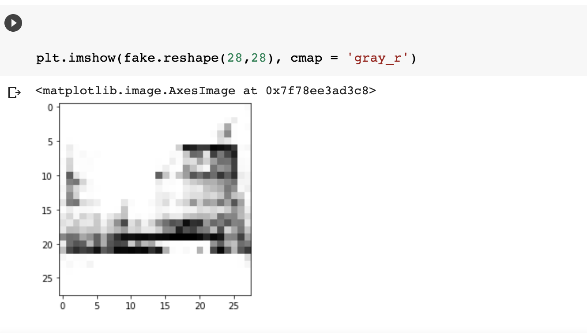

# Accelerated-WGAN-GP
## Accelerated WGAN update strategy with loss change rate balancing (2020)
#### Loss 함수로 Wasserstein Loss 를 사용하는 GAN 모델을 좀 더 효과적으로 훈련시키기 위한 전략 소개.
#### 고정된 step의 Critic, Generator 훈련이 아닌 특정 기준에 따라 Adaptive한 훈련 시행

##### Result : 
##### 3에폭만에 나온 결과물인데 실제로 모델이 돌아갈 때 원래의 GAN 모델과 달리 한번 미니 배치가 들어올 때 Critic 과 Generator 둘 중 하나만 훈련이 된다. 기존 GAN 기준으로 하면 1.5 에폭만에 나온 결과라고 할 수 있다. (엄청 조금 훈련 했는데 신발의 형태 표현이 아주 잘 되었음.)
